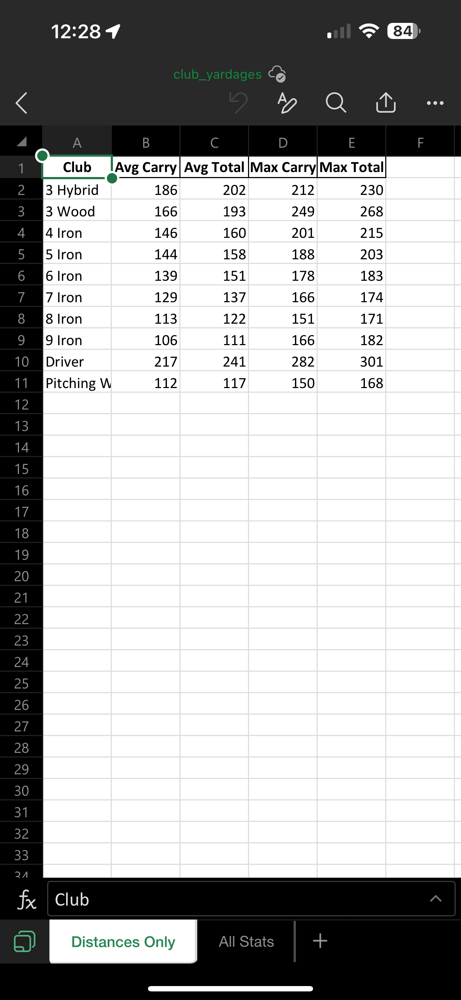
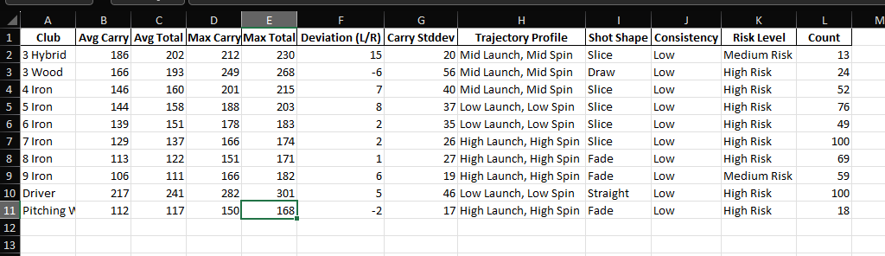

# Golf Range Analyzer for Garmin R10 Data

A Python script that processes driving range session data from Garmin R10 launch monitors, calculating weighted averages and performance metrics.




## Features

- Processes Excel and CSV exports from Garmin Golf app
- Calculates weighted averages (recent shots weighted more heavily)
- Provides club-by-club performance metrics:
  - Carry distance and total distance averages (units will reflect your Garmin Golf app unit settings, be mindful if you change them)
  - Left/right deviation analysis
  - Trajectory profiles (high/mid/low launch and spin)
  - Shot shape tendencies (draw/fade)
  - Consistency ratings
  - Risk assessment

## How It Works

1. After each range session with your Garmin R10:
   - Export the data from the Garmin Golf app to Excel
   - Save the file to your designated OneDrive folder (or local folder)
2. The script automatically:
   - Combines all session data
   - Filters out unrealistic shots
   - Calculates weighted performance metrics
   - Generates a club-by-club yardage report

## Setup Instructions

1. **Prerequisites**:
   - Python 3.6 or later
   - Garmin R10 launch monitor
   - Garmin Golf app (to export session data)

2. **Installation**:
   ```bash
   git clone https://github.com/HaydenBussard/r10_data_analyzer.git
   cd r10_data_analyzer
   pip install -r requirements.txt

3. **Configuration**:
   - Modify the folder_path variable in club_data.py to point to your folder containing the Excel exports
   - My path for reference: /Users/hayde/OneDrive/Golf Practice/Driving Range

4. **Usage**:
   python club_data.py

   The script will output an Excel file with your club yardages at whichever folder you set OUTPUT_FILE to. I've used OneDrive to simplify data saving and on-course reference (/Users/hayde/OneDrive/Golf Practice/club_yardages.xlsx)

## Customization Options

   - Weighting recent shots: Adjust the decay_factor variable (default 0.05) to change how much more recent shots are weighted
   - Club distance ranges:
      - Modify the club_ranges dictionary to set realistic min/max distances for each club. Their initial setting is (0,400) for each club for testing purposes. Shots outside of your acceptance range will be omitted from data analysis.
      - To remove or add a club to the output file, adjust the club_ranges dictionary as necessary. The naming of the clubs must match the naming from the imported Garmin Golf range session files.
   - Output location: Change the output_file variable to save results to a different location

## Sample Data

   - The sample_data folder contains example Excel exports from the Garmin Golf app. You can use these to test the script.

## Contributing

   - Contributions are welcome! Please open an issue or pull request for any improvements.

## License

   - This project is licensed under the MIT License - see the LICENSE file for details.
